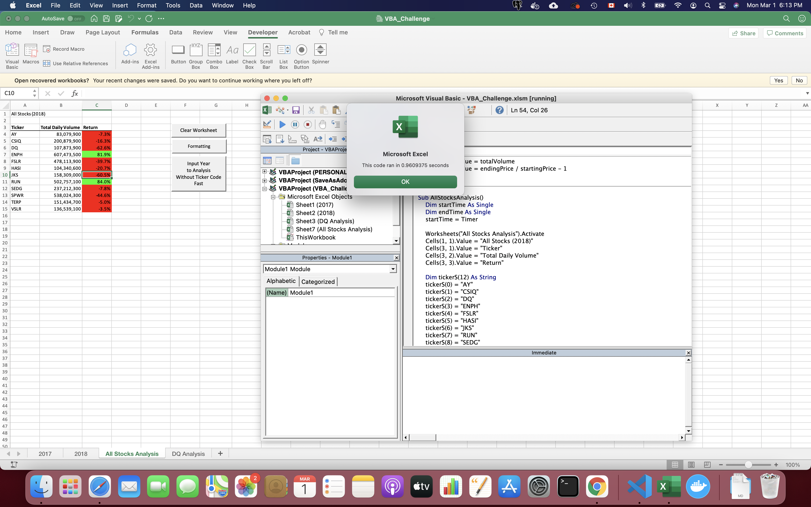
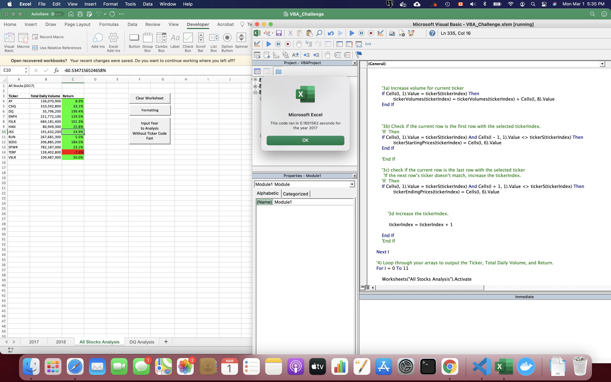
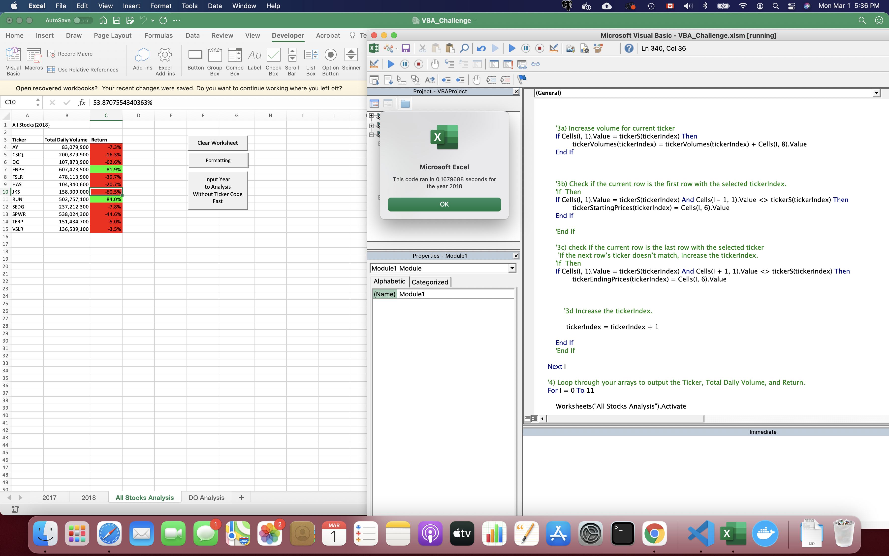

# Refactoring Code

### Overview of Project:

In order to improve performence of code, rewrite this code.

### Results

In original version, the script runs about 0.96 seconds to get resuls.

In refactoring code, the script runs about 0.16 seconds to get resuls.

### Summary

1. What are the advantages or disadvantages of refactoring code?

* advantages: The refactoring code use only one loop to get the results, it is faster than original version.
* disavantasges: In refactoring code, I need to typing ticker code in advance. if order of ticker changed, or new ticker included, the function will not work.

2. How do these pros and cons apply to refactoring the original VBA script?

In fact, before seeing this challenge, I have made a optimization version. At beginning, my purpose is not exactly to improve performance, I just want to analyze all stocks without input tickers codes, so that it can adopt different data source. Finally, when I added timer check, I find that it was extremely fast. The new version is about 40 times faster then original if not include formatting code.

